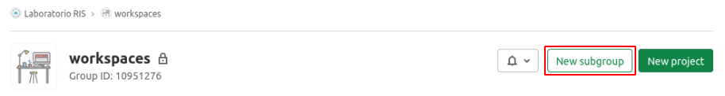
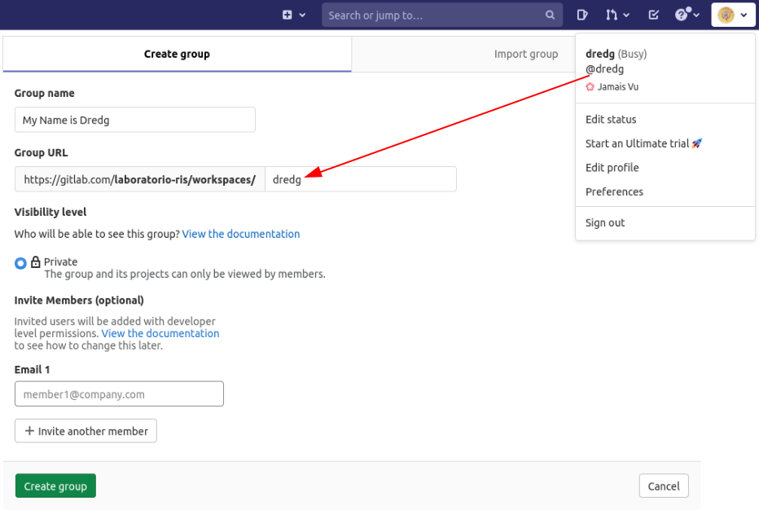
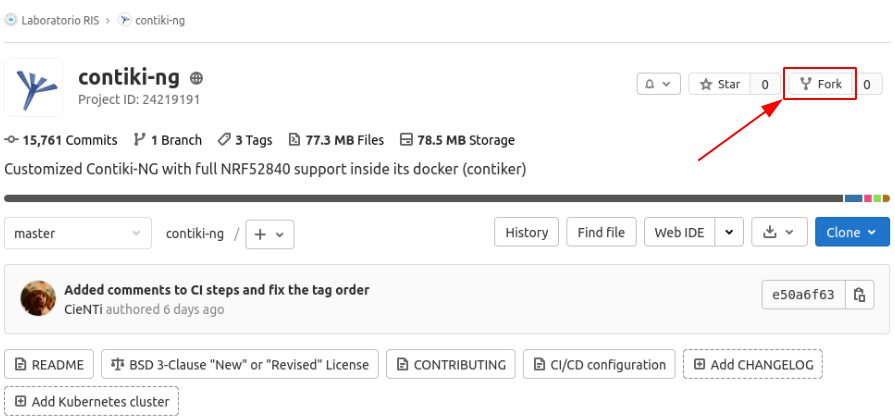

# Contiki-NG para practicas de RIS

Este repositorio es una replica del original con las modificaciones necesarias para soportar los dongles basados en NRF52840 (versiones Nordicsemi y Makerdiary).

Se incluye una carpeta [`doc`](doc) con información referente a las prácticas o a las placas usadas.

## Documentacion extra o para consulta

- [Preparación de la maquina virtual: VirtualBox](doc/es/prepare-vm_virtualbox.md)
- [Comandos de `git` para las prácticas](doc/es/git-cheatsheet.md)
- [Información de los dongles nRF52840 usados para las prácticas](doc/es/dongles-info.md)
- [Modificaciones sobre el repositorio original](doc/es/repository-info-n-mods.md)
- [README.md original de Contiki-NG, sin modificar](README.original.md)

## Preparación del entorno de desarrollo local

El entorno de desarrollo estará contenido en una imagen/contenedor de [Docker](https://www.docker.com/). Esto permitirá que se parta de un entorno pre-fijado y controlado, evitando por tanto errores entre versiones o instalaciones innecesarias.

### Maquina virtual

Contiki-NG, en sus versiones mas recientes, proporciona un entorno de desarrollo completo y testeado por sus desarrolladores en formato Docker. Esto evita la necesidad de instalar la mayoría del software, ademas de eliminar problemas de versiones, como ya se vio anteriormente.

Muy resumidamente, Docker es un sistema de virtualización que permite arrancar lo que se llaman *contenedores*. Dentro de estos contenedores se ejecutará generalmente un Linux extremadamente reducido, con los paquetes y programas necesarios para hacer una tarea concreta.

Debido a limitaciones de Windows y el uso de USB, no es posible desarrollar la practica completa usando solo Windows y Docker: Se pueden compilar programas para la placa, pero no se pueden flashear/subir a la placa por dichos problemas con los puertos USB.

Este problema recurrente en Windows se salva mediante máquinas virtuales con Linux instalado, como se ha podido comprobar en diferentes situaciones. Para este caso, se usará la versión de Ubuntu con escritorio y ligera `Lubuntu 20.04`, que se proporcionará con todo lo necesario para arrancar la práctica.

### Entorno virtual

Lo explicado en el punto anterior indica el uso de 2 sistemas diferentes de virtualizacion: Maquina virtual y Docker. Esto puede generar confusión si no se ejecutan ciertos comandos dentro del entorno adecuado, pero es extremadamente sencillo una vez se entiende estos detalles.

Las diferentes capas, por tanto quedan algo como:

1. El sistema operativo principal actuará como sistema anfitrión, por lo general Windows, donde se ejecutará una maquina virtual. Si se necesita intercambiar ficheros entre el ordenador y la maquina virtual, se recomienda hacerlo mediante el uso de carpetas compartidas (en la propia configuración de la maquina virtual).
2. Una vez arrancada la maquina virtual, habrá partes que sean gráficas y otras que requieran del uso de la consola o terminal. El icono para abrirla se encuentra tanto en los menus, como en la barra de inicio, al lado del icono de Firefox.
3. Dentro de esta consola, al ejecutar `contiker` se accederá a la consola 'final', donde reside todo el entorno de desarrollo de Contiki junto a todo lo necesario para programar la placa de NRF52840. *Este comando puede fallar si no se ha clonado correctamente el repositorio*

### Instalación en Windows. VirtualBox

En el documento '[Preparación de la maquina virtual: VirtualBox](doc/es/prepare-vm_virtualbox.md)' se explica paso a paso el proceso de creación de la máquina virtual.

Una vez se sigan los pasos, y quede terminado el bloque, es posible continuar al clonado (descarga) del repositorio.

## Preparación de la carpeta de trabajo

### Crear grupo personal en Gitlab

Cada persona creará un grupo dentro de [workspaces](https://gitlab.com/laboratorio-ris/workspaces) usando el botón de la siguiente figura:



El nombre de grupo será el nombre de la persona, y la parte editable de la URL del grupo, será el identificador de usuario (sin la '@'). En la siguiente figura se muestra un ejemplo y donde leer rápidamente el identificador de usuario:



Una vez creado, deberá quedar una dirección URL con el identificador de usuario integrado en ella, que según el ejemplo de la figura anterior sería: `https://gitlab.com/laboratorio-ris/workspaces/dredg`.

> **NOTA**: En caso de equivocación casi todo es editable, y en el peor de los casos es cuestion de borrar y empezar de nuevo. Pregunta

El grupo permite separar el trabajo de cada persona, y entre otras cosas, que no colisionen nombres y se pueda mantener `contiki-ng` de forma individual, como se indica a continuación.

### Importar repositorio de trabajo en Gitlab

Cada persona va a crear una copia de este repositorio dentro de su carpeta personal, y para facilitar la tarea (además de mantener las relaciones entre repositorios), se hará mediante el método llamado `fork`.

Para esto, lo primero será entrar en [Contiki-NG](https://gitlab.com/laboratorio-ris/contiki-ng) e ir a la sección de fork, como se muestra en la imagen:



La pantalla siguiente mostrará los posibles emplazamientos donde GitLab permite copiarlo, y debería aparecer el grupo recien creado, como se ve en la figura. Es fácil confirmarlo ya que debe verse la etiqueta `Owner` tras el nombre (lo que indica control total sobre ese grupo, tanto de creación, como de gestión, como de borrado).


### Siguiente paso

Cada persona debe tener ya su repositorio personal: Este contiene todo el código de Contiki necesario para las prácticas, aunque por ahora está solo en Gitlab.

Para poder trabajar con él es necesario clonarlo en el entorno de desarrollo como sigue.

## Clonado del repositorio en el entorno de desarrollo

A partir de ahora todo el trabajo se hará en la propia máquina virtual y, solo cuando sea necesario, se indicará atender a algo que esté fuera de esta (como las conexiones USB, que se deben habilitar desde VirtualBox).

> **NOTA**: Este procedimiento tambien puede encontrarse en el fichero `cheatsheet.txt` que puede verse en el escritorio de la maquina virtual, de forma que sea fácil copiar y pegar.

Dentro de una consola (terminal) se debe proceder como sigue:

```bash
# Crear la carpeta donde ira contiki, si no existe
mkdir -pv "${HOME}/work/contiki-ng"
# Entrar dentro de la carpeta 'work'
cd "${HOME}/work"
# Clonar el repositorio personal de contiki (editar 'dredg' acorde al identificador de cada persona)
git clone https://gitlab.com/laboratorio-ris/workspaces/dredg/contiki-ng.git ${HOME}/work/contiki-ng/
# Entrar dentro de la carpeta de contiki
cd "${HOME}/work/contiki-ng"
# Descargar todos los submodulos necesarios
git submodule update --init --recursive
```

Una vez terminado el proceso se puede pasar a comprobar la programación, mediante el test inicial.

## Test inicial: `Hello World`

Dentro de una consola se ejecuta el comando `contiker`, que abrirá una sesión con el entorno virtual de Contiki-NG bajo Docker, viendose algo similar a:

```bash
user@a939004e869d:~/contiki-ng$
```

El hecho de que aparezca `user@xxxx` indica que todos los comandos se ejecutarán dentro del entorno de desarrollo virtual, y que ademas ya está localizado dentro de la carpeta de trabajo `contiki-ng`.

Si no fuera asi, y siempre que se quiera volver a la carpeta de trabajo de contiki, podremos hacerlo mediante cualquiera de los siguientes comandos:

```bash
cd ~/contiki-ng
o
cd $HOME/contiki-ng
o
cd /home/user/contiki-ng
```

Si cualquiera de estos 3 comandos falla, es muy probable que no se esten ejecutando dentro del sistema virtual dockerizado (`contiker`).

Una vez dentro, se compila el ejemplo de hello-world como sigue:

```bash
cd examples/hello-world
make
```

Si la compilación termina sin problemas, se puede pasar a flashear/programar la placa. Esto se hará con agregando el sufijo `.dfu-upload` como sigue:

```bash
make hello-world.dfu-upload
```

Si no hay problemas, se debe ver algo parecido a:

```bash
Zip created at build/nrf52840/dongle/nrf52840_dfu_image.zip
nrfutil dfu usb-serial -p /dev/ttyACM0 -pkg build/nrf52840/dongle/nrf52840_dfu_image.zip
  [####################################]  100%
Device programmed.
```

Y si los hay, lo primero es confirmar que el dongle se encuentra en modo `DFU`:

- Dongle de Makerdiary: Desenchufar el dongle, pulsar y mantener USR/RST mientras se enchufa de nuevo, esperar 2/3 segundos y soltar el pulsador.
- Dongle de Nordicsemi: En este caso no hay necesidad de desenchufar y bastará con presionar el pulsador RST.

> Si el led rojo comienza a encenderse y apagarse de forma gradual, **ya está en modo DFU**.

Para comprobar el puerto serie (VCOM), despues de flashear correctamente ejecutamos:

```bash
picocom -fh -b 115200 --imap lfcrlf /dev/ttyACM0
```

Si se recibe la cadena de texto `Hello, world` de forma periódica es que todo ha ido bien. Para salir de picocom se debe presionar `Ctrl + a` y luego `Ctrl + x` (sin soltar la tecla `Ctrl` es mas cómodo).
