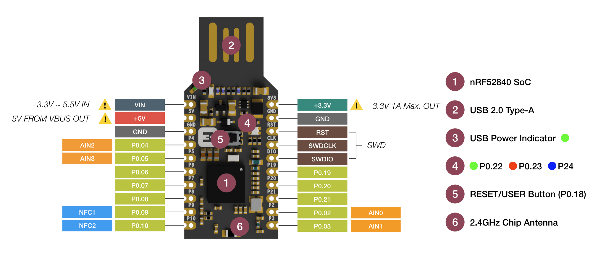
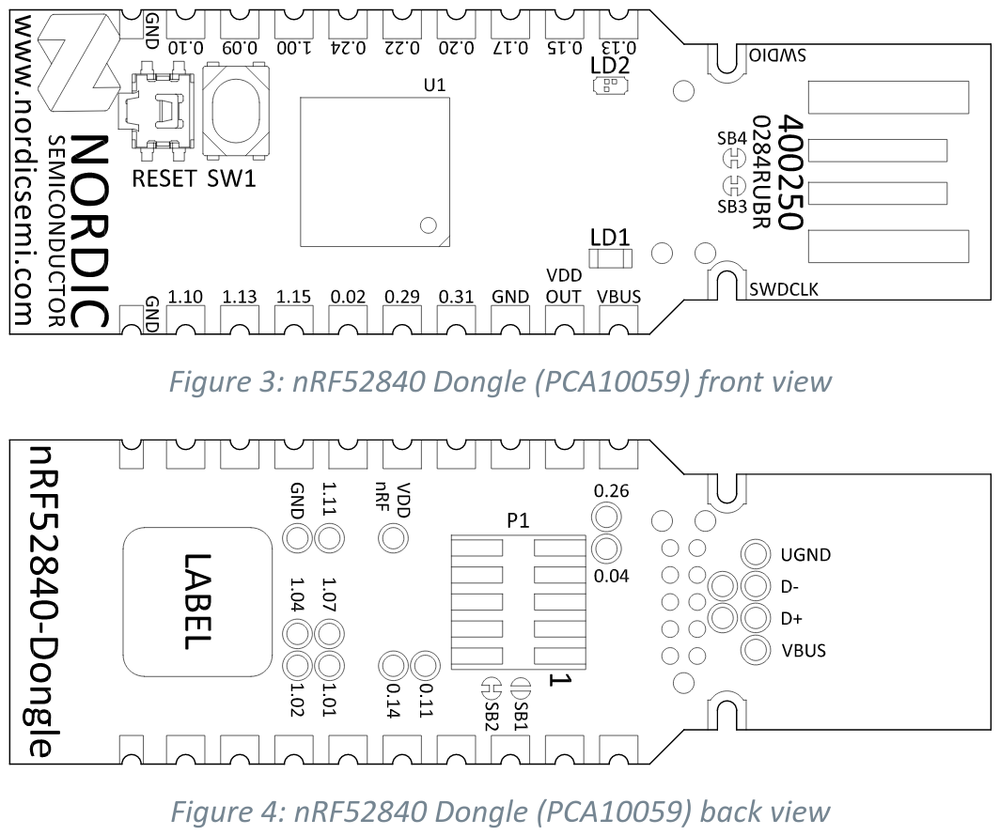

# Dongles usados para las prácticas

---

## Makerdiary 'nRF52840 MDK USB Dongle'

### Información basica

- [Página oficial del dongle](https://wiki.makerdiary.com/nrf52840-mdk-usb-dongle/)
- [Cómo programarlo](https://wiki.makerdiary.com/nrf52840-mdk-usb-dongle/programming/)
- [Open-Bootloader](https://github.com/makerdiary/nrf52840-mdk-usb-dongle/tree/master/firmware/open_bootloader)
- [Ficheros de Hardware](../asset/makerdiary-dongle_hardware-files_1.0.0.zip)

### Pinout

---

## Nordic Semiconductors 'nRF52840 Dongle (PCA10059)'

### Información basica

- [Página oficial del dongle](https://www.nordicsemi.com/Software-and-tools/Development-Kits/nRF52840-Dongle)
- [Manual de Usuario oficial](../asset/nordicsemi-dongle_user-guide.pdf)
- [Ficheros de Hardware](../asset/nordicsemi-dongle_hardware-files_2.0.0.zip)

### Pinout

---
