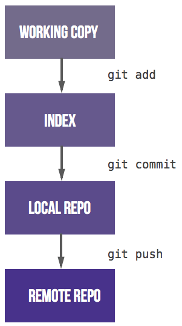

# Comandos de `git` para las prácticas

[[_TOC_]]

Para entender las operaciones a realizar, y su simpleza, es necesario tener algo de contexto primero y comenzar sabiendo lo que es un repositorio git.

## Qué es un repositorio `git`?

En su descripción mas simple un **repositorio** es un lugar donde guardar cosas, y para este caso será un lugar donde guardar ficheros y carpetas.

Tambien simplificado, **git** es un sistema que permite hacer un seguimiento de cambios en cualquier conjunto de carpetas o ficheros. Parte de sus caracteristicas incluyen la velocidad, la integridad de datos y la capacidad para trabjar con flujos de trabajos distribuidos y no necesariamente lineales.

Si unimos ambos conceptos, se obtiene una carpeta cuyo contenido se gestiona mediante un sistema de seguimiento de cambios, o mas bien conocido como **repositorio git**.

El programa que controlará todo es `git` seguido del comando deseado, y para comenzar, lo mejor es consultar su ayuda ejecutando `git help` en una consola.

A modo informativo, su salida será algo como:

```bash
# Comando a ejecutar:
git help
# Salida esperada:
usage: git [--version] [--help] [-C <path>] [-c <name>=<value>]
           [--exec-path[=<path>]] [--html-path] [--man-path] [--info-path]
           [-p | --paginate | -P | --no-pager] [--no-replace-objects] [--bare]
           [--git-dir=<path>] [--work-tree=<path>] [--namespace=<name>]
           <command> [<args>]

These are common Git commands used in various situations:

start a working area (see also: git help tutorial)
   clone      Clone a repository into a new directory
   init       Create an empty Git repository or reinitialize an existing one

work on the current change (see also: git help everyday)
   add        Add file contents to the index
   mv         Move or rename a file, a directory, or a symlink
   reset      Reset current HEAD to the specified state
   rm         Remove files from the working tree and from the index

examine the history and state (see also: git help revisions)
   bisect     Use binary search to find the commit that introduced a bug
   grep       Print lines matching a pattern
   log        Show commit logs
   show       Show various types of objects
   status     Show the working tree status

grow, mark and tweak your common history
   branch     List, create, or delete branches
   checkout    Switch branches or restore working tree files
   commit     Record changes to the repository
   diff       Show changes between commits, commit and working tree, etc
   merge      Join two or more development histories together
   rebase     Reapply commits on top of another base tip
   tag        Create, list, delete or verify a tag object signed with GPG

collaborate (see also: git help workflows)
   fetch      Download objects and refs from another repository
   pull       Fetch from and integrate with another repository or a local branch
   push       Update remote refs along with associated objects
```

> **NOTA**: Para obtener información de cualquier comando hay que recurrir a su ayuda, que se puede obtener mediante:
> 
> - `git help comando`
> - `git comando --help`
> 
> Esto abrirá un navegador de texto mostrando toda la ayuda relacionada al comando en cuestión.

Para las prácticas sólo son necesarios algunos de ellos:

- `git clone`
Descarga o 'clona' un repositorio remoto en una carpeta local, llamada 'working copy'.
- `git status`
Muestra información del estado actual del repositorio, indicando cuando hay cambios revisados o por revisar.
- `git submodule`
Trabaja con los repositorios secundarios asociados al repositorio principal, llamados 'submodulos'
- `git add`
Agrega el o los ficheros en cuestión a la lista de revisados (término 'staged').
- `git commit`
Crea un registro en la historia del repositorio, llamado revisión, indicando los cambios que hay con respecto a la revisión anterior.
- `git push`
Envía la historia local al servidor remoto, creando por tanto una copia remota de la carpeta de trabajo local.

Tras esto se puede deducir que **NO se verá reflejado ningún cambio en GitLab si no se ha agregado(`git add`), revisado(`git commit`) y subido(`git push`)**, o visto de otra forma, el flujo básico de trabajo debe ser algo como:



## `git clone`: Clonado del repositorio

Visto previamente en el '[Clonado del repositorio en el entorno de desarrollo](https://gitlab.com/laboratorio-ris/contiki-ng#clonado-del-repositorio-en-el-entorno-de-desarrollo)', de forma simplificada esta operación cumple varias funciones:

- Descarga del contenido completo de una carpeta
- Descarga de todo el histórico de ficheros y ramas
- Crea el enlace entre el servidor de git y la carpeta local

De esta forma creamos una carpeta con contenido (repositorio), gestionada por git, por lo que tenemos un repositorio git.

El ejemplo siguiente muestra como se clona el repositorio maestro de Contiki:

```bash
# Comando a ejecutar:
git clone https://gitlab.com/laboratorio-ris/contiki-ng.git
# Salida esperada:
Cloning into 'contiki-ng'...
remote: Enumerating objects: 129977, done.
remote: Counting objects: 100% (129977/129977), done.
remote: Compressing objects: 100% (30543/30543), done.
remote: Total 129977 (delta 92167), reused 129949 (delta 92150), pack-reused 0
Receiving objects: 100% (129977/129977), 82.06 MiB | 10.54 MiB/s, done.
Resolving deltas: 100% (92167/92167), done.
```

En caso de ser un repositorio protegido se pedirá usuario y contraseña, pero el resto del proceso será idéntico.

## `git status`: Consulta del estado del repositorio

Para saber si hay algún fichero o carpeta modificados se usará el `git status`.

Cuando no hay ningún cambio debería verse una salida como:

```bash
# Comando a ejecutar:
git status
# Salida esperada:
On branch master
Your branch is up to date with 'origin/master'.

nothing to commit, working tree clean
```

Si hay cambios que aún no se han revisado/preparado se indicará como '*not staged*'. En el siguiente ejemplo se modifica el fichero `README.md` pero no se prepara, y `git status` lo indica mediante:

```bash
# Comando a ejecutar:
git status
# Salida esperada:
On branch master
Your branch is up to date with 'origin/master'.

Changes not staged for commit:
  (use "git add <file>..." to update what will be committed)
  (use "git restore <file>..." to discard changes in working directory)
        modified:   README.md

no changes added to commit (use "git add" and/or "git commit -a")
```

Si por el contrario los cambios están preparados se considerarán como '*staged*':

```bash
# Comando a ejecutar:
git status
# Salida esperada:
On branch master
Your branch is up to date with 'origin/master'.

Changes to be committed:
  (use "git restore --staged <file>..." to unstage)
        modified:   README.md
```

## `git submodule`: Submódulos (repositorios secundarios)

Aunque este comando se abre en un gran abanico de posibilidades, en el caso del repositorio de prácticas solo interesa una: `git submodule update --init --recursive`.

Al ejecutar ese comando, git se encargará de descargar todos los repositorios secundarios y colocarlos en el sitio adecuado, de forma que cualquier dependencia del entorno de desarrollo quede satisfecha.

## `git add`: Agregar cambios a lista de revisados

Agregar cambios a la lista de archivos revisados no es otra cosa que indicarle a `git` que ciertos ficheros, tras alguna modificación, ya pueden incluirse en el histórico de cambios. Esto hará cambiar el estado de un fichero de 'not staged' a 'staged'.

Si no se desea entrar en detalle, se puede usar `git add .` (el punto al final es necesario y significa "cualquier cambio de cualquier archivo").

Si no hay conflictos, este comando no genera salida.

## `git commit`: Crear registro de cambios

**_ESTE COMANDO ES EL MAS IMPORTANTE_**

Cuando ya existen cambios en la lista de revisados es cuando se puede pasar a registrarlos.

Este registro, como se dijo anteriormente, salva en la historia de cambios local la diferencia que existe entre la revisión actual y la anterior, estableciéndose por lo tanto como la nueva revisión de la que partirá la siguiente revisión que se registre.

Este proceso iterativo hace que desarrollar algo sea un algo evolutivo, ya que si se hace buen uso quedará registrado cada grupo de cambios, y con estos sus posibles errores. Esto simplificará la tarea de trazar un error hasta su origen, ya que podrá verse el commit exacto en el que apareció y las posibles consecuencias que ha podido tener desde entonces.

Es habitual que se muestre una reticencia inicial a hacer commits "por si es poco", "por si es una tontería" o "por si no es lo suficiente bueno", entre otras. Nada mas lejos de la realidad, **los commits son gratis**, por lo que no hay motivo para escatimar en ellos. Será mucho mas dificil hacer un seguimiento de cambios y errores si hay un único commit con todo el fichero.

Por lo tanto:

**ES SUPER EXTREMADAMENTE MEGA RECOMENDABLE HACER TANTOS COMMITS COMO SEA NECESARIO, INCLUSO MAS**

Con este concepto claro se puede pasar a la segunda parte, igualmente importante: El *mensaje* o *comentario*.

Es tambien habitual que muchos commits, sobre todo los primeros, tengan un mensaje del tipo "Cambio en main.c". Esto, aunque de primeras pueda parecer algo descriptivo, a la larga no sirve para nada y debe evitarse a toda costa. Por el contrario, algo tan simplista como "Ahora ya programa" es infinitamente mas útil, aunque en ese commit sea "main.c" el único fichero implicado.

Esto es fácil de entender haciendose una pregunta: "Me acordaré de esto dentro de X tiempo?". La respuesta es única: NO. Ver "cambio en main.c" no dice nada mientras que "Ya programa" indica un **concepto de commit** claro, la idea que había detrás de esa modificación.

**UN COMMIT DEBE TENER SIEMPRE UN MENSAJE QUE DESCRIBA UNA IDEA, CONCEPTO O ACCIÓN**

Y por aclarar posibles dudas: Es muy válido "aqui se queda por hoy, me voy a dormir", mucho mas que "main.c OK" y aun mejor que no hacer commit en absoluto.

Todo esto se reduce a:

```bash
# Comando a ejecutar:
git commit -m "Arreglado el radioenlace, ya recibe"
# Salida esperada:
[master b06d57ca0] Arreglado el radioenlace, ya recibe
 1 file changed, 1 insertion(+)
```

### Faltan datos de identidad ?

Es normal que el primero de todos los commits falle por falta de datos de identidad, mostrándose algo como:

```bash
# Comando a ejecutar:
git commit -m "Arreglado el radioenlace, ya recibe"
# Salida esperada:
*** Please tell me who you are.

Run

  git config --global user.email "you@example.com"
  git config --global user.name "Your Name"

to set your account's default identity.
Omit --global to set the identity only in this repository.

fatal: unable to auto-detect email address (got 'vmu@vm-devel.(none)')
```

Sólo será necesario ejecutar los dos comandos `git config` adaptados a los datos de cada persona, y el resto de comandos que los necesiten no deberían volver a tirar error.

### Se pide la pareja de `git config` mas de una vez ?

Correcto, y el motivo es porque en lugar de ejecutar los comandos de git en la consola de la máquina virtual, se han ejecutado dentro de `contiker`.

Como se ha explicado, `contiker` es un comando que abre un entorno de desarrollo dockerizado y que no guarda su estado entre una ejecución y la siguiente. Esto hará que durante una sesión funcionen tantos comandos como se ejecuten detrás de los `git config`, pero que una vez se cierre y se vuelva a abrir, no tenga constancia de ellos y se necesiten introducir de nuevo.

Si todos los comandos de git se ejecutan en una consola de la máquina virtual y no dentro de contiker, estos cambios se guardarán y no se volverán a pedir. Por lo dicho anteriormente, esto no afecta a contiker por ser un entorno aislado, por lo que los comandos dentro de él seguirán necesitando un `git config` inicial.

> **RECOMENDACIÓN**: Abrir una consola donde ejecutar los comandos de git y otra donde trabajar dentro de contiker. Será más simple el seguimiento de dos tareas tan diferenciadas como son estas.

## `git push`: Enviar historia local al servidor remoto

Cuando se quieran enviar los cambios en la historia al servidor remoto se hará mediante `git push` en su versión reducida, o `git push origin master` en su versión completa.

La versión reducida solo es aplicable si previamente existe esa relación. Como el repositorio surge desde un `git clone`, dicha relación ya existe y es posible usar `git push`.

```bash
# Comando a ejecutar:
git push
# Salida esperada:
Enumerating objects: 5, done.
Counting objects: 100% (5/5), done.
Delta compression using up to 2 threads
Compressing objects: 100% (3/3), done.
Writing objects: 100% (3/3), 298 bytes | 298.00 KiB/s, done.
Total 3 (delta 2), reused 0 (delta 0)
To https://gitlab.com/laboratorio-ris/contiki-ng.git
   8bde2bf2d..153abd830  master -> master
```

## Error común: `fatal: not a git repository (or any of the parent directories): .git`

Como se ha descrito anteriormente, es recomendable estar en una consola de la maquina virtual (`vmu@vmu-devel`) y no de contiker (`user@<numeracion>`), por lo que lo primero a confirmar es si la consola es la correcta.

Una vez confirmada, ejecutar uno u otro comando según el caso:

```bash
# Para consola en la máquina virtual, el directorio de trabajo de contiki está
# localizado en /home/vmu/work/contiki-ng ($HOME/work/contiki-ng)
cd $HOME/work/contiki-ng
# Para consola en la máquina virtual, el directorio de trabajo de contiki está
# localizado en /home/user/contiki-ng ($HOME/contiki-ng)
cd $HOME/contiki-ng
```

Si este comando falla es necesario revisar de nuevo si la consola es válida, y si es el caso, si el repositorio existe y está bien clonado, ya que tal como se ha provisto el contenido dicho fallo no debería ocurrir.

## Me parece poco

En caso de hacer o necesitar un uso mas avanzado del expuesto aqui, hay toda clase de variantes que se pueden aplicar a los comandos.

Llegado ese caso se recomienda leer la ayuda como se ha descrito anteriormente o pedir ayuda/orientación, ya que la solución suele ser mas simple de lo que parece.

